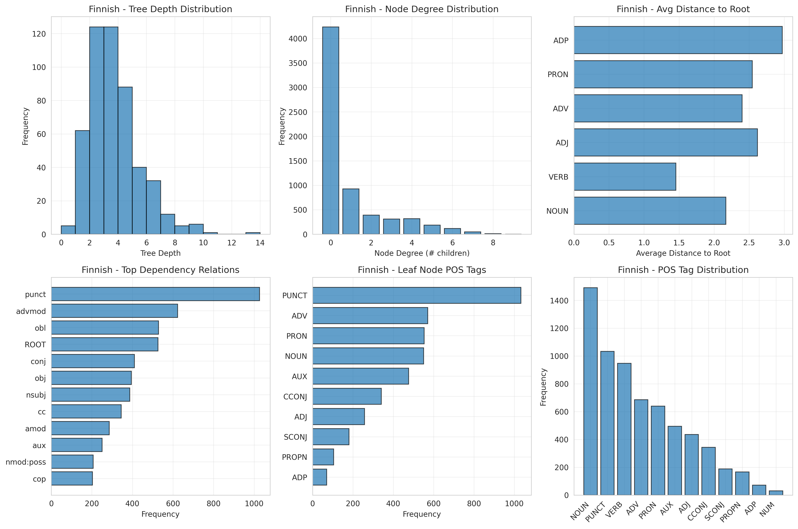

# Language as Data - Assignment 1 Report
## Comparative Analysis of Finnish and Hindi Corpora

**Course:** Language as Data (Winter 2025/26)  
**Instructors:** Lisa Beinborn, Jonas Mayer Martins  
**Date:** November 16, 2025

---

## Executive Summary

This report presents a comprehensive linguistic analysis comparing Finnish and Hindi through three main deliverables: language characteristics and corpus documentation (Part A), corpus statistics and morphological analysis (Part B), and dependency parsing (Part B). Our analysis reveals fundamental differences between these languages from distinct language families—Finnish from the Uralic family and Hindi from Indo-European—in terms of morphological complexity, syntactic structure, and distributional patterns.

**Key Findings:**
- Finnish exhibits significantly higher type-token ratio (0.104) compared to Hindi (0.004), reflecting its rich inflectional morphology
- Finnish words are substantially longer (avg 6.48 characters) than Hindi words (avg 3.83 characters)
- BPE tokenization shows Finnish requires more sub-word tokens for rare words (avg 3.34) compared to Hindi (avg 2.83)
- Dependency parsing reveals Finnish has shallower tree depth (avg 3.25) with distinct syntactic patterns

---

## Part A: Language Data

### Deliverable 1: Language Characteristics

#### Hindi

**Name(s) of the language:**  
In English, the language is called "Hindi". In the language itself, it is called "आधुनिक मानक हिन्दी" (Ādhunik Mānak Hindī using Hunterian transliteration) [1].

**Number of speakers:**  
Approximately 600 million people speak Hindi, with more than 350 million native (L1) speakers [2][3]. It ranks as the language with the 3rd most speakers overall and 2nd most L1 speakers globally [5].

**Preservation status:**  
Hindi is not endangered. It is widely spoken as a native language and used for education and administration in India [4].

**Geographic region:**  
Hindi is primarily spoken across northern and central India, with significant diaspora communities in the USA, Canada, Europe, Nepal, Mauritius, and Fiji [5]. Historically, Hindi is a direct descendant of an early form of Vedic Sanskrit, which originated in the northwestern Indian subcontinent [6].

**Language family:**  
Hindi belongs to the Indo-European language family, within the Indo-Iranian → Indo-Aryan branch. It is part of the Indian Sprachbund where languages from Indo-Aryan (Hindi, Punjabi), Dravidian (Tamil, Telugu), and Munda (Santali) families have developed similar features due to contact [7].

**Grammar:**
- **Word order:** SOV (Subject-Object-Verb) [8]
- **Synthesis:** Moderately synthetic with 2-3 categories per word (CPW) [9]
- **Morphology:** Strongly suffixing (>80% of inflectional affixes are suffixes)
- **Ergativity:** Aspect-split ergative system—subject of transitive verbs marked with ergative case only in perfective/past aspect [10]
- **Consonant-vowel ratio:** Moderately high (4.5-6.5 times as many consonants as vowels) [11]
- **Tonality:** Non-tonal language
- **Cases:** Three noun cases (nominative, oblique, vocative) and five pronoun cases (nominative, accusative, dative, genitive, oblique) [12]

**Orthography:**  
Hindi uses the Devanagari script, an abugida consisting of 11 vowels and 33 consonants, written left to right [13]. Devanagari belongs to the Brahmic family of scripts, evolving from the Brāhmī script (3rd century BCE) through the Nagari script [14]. The Indian government uses Hunterian transliteration for official Latin-script representation [1].

#### Finnish

**Name of the language:**  
The native name is "suomi".

**Number of speakers:**  
Approximately 5 million people use Finnish as their native language, with around 500,000 speaking it as a second language in Finland [15].

**Preservation status:**  
Finnish is not endangered.

**Geographic region:**  
Finnish is mainly spoken in Finland, with some speakers in regions of Sweden and Norway.

**Language family:**  
Finnish is a Finnic language, a branch of the Uralic family. Related Finnic languages include Estonian (Estonia), Karelian (Russia's Karelia), Veps (northwestern Russia), Meänkieli (Sweden), and Kven (Norway). Meänkieli and Kven are historical varieties of Finnish that remain mutually intelligible [17]. Finnish is part of the Circum-Baltic Sprachbund, which includes Baltic (Latvian, Lithuanian), Slavic (Russian), and Germanic (Swedish) languages [18].

**Grammar:**
- **Word order:** SVO (Subject-Verb-Object)
- **Synthesis:** Moderately synthetic with 2-3 categories per word [9]
- **Morphology:** Strongly suffixing
- **System:** Accusative (marks direct objects with special endings)
- **Persons:** Three grammatical persons (first, second, third) [19]
- **Tenses:** Two real tenses (present, past) with perfect constructions yielding four basic forms
- **Future:** No separate inflectional future tense; context indicates future meaning [20]
- **Word formation:** Highly agglutinative—builds new words by adding suffixes rather than using separate words [19]
- **Consonant-vowel ratio:** Moderately low (fewer consonants relative to vowels) [11]
- **Tonality:** Non-tonal
- **Cases:** More than 10 cases (compared to English's 2) [21]

**Case system example:**
- talo = house
- talossa = in the house
- talosta = from the house
- taloon = into the house
- talotta = without the house

**Orthography:**  
Finnish uses the Latin script with an alphabet derived from Swedish. The official alphabet consists of 29 letters, with two additional letters appearing in loanwords [22].

---

### Deliverable 2: Corpus Datasheet

#### Hindi Corpus: Leipzig Corpora Collection - Hindi News 2022

**Basic Information:**
- **Source:** Wortschatz Leipzig [23][24]
- **Size:** 100,000 sentences
- **Type:** News corpus
- **Language Code:** hin
- **Download:** https://wortschatz.uni-leipzig.de/en/download/hin

**Key Datasheet Findings:**

**Composition (Q1-Q10):**

*Q1: What do instances represent?*  
Each instance represents a single sentence extracted from Hindi-language news websites using automated sentence boundary detection algorithms [24].

*Q2: How many instances?*  
100,000 sentences. Leipzig provides Hindi corpora in multiple sizes (10K, 30K, 100K, 300K, 1M sentences) [23][24].

*Q3: Sample or exhaustive?*  
This is a sample collected via automated RSS feed monitoring during 2022 [24]. **Biases include:**
- Genre bias: Only news content (excludes social media, blogs, literature, conversation)
- Source bias: Limited to outlets with RSS feeds (may exclude regional/local newspapers)
- Temporal bias: Only 2022 language use

*Q4: What data does each instance contain?*  
- Unique sentence identifier
- Sentence text in Devanagari script
- Pre-computed word co-occurrence statistics
- **Missing:** URLs, dates, authors, article titles, document context

*Q5: Missing information?*  
Substantial metadata absent:
- No source attribution (URLs, dates, outlets)
- No author information
- No document context (sentences isolated from articles)
- No genre/topic labels
- No demographic information
- No quality indicators

*Q6: Errors and noise?*  
Potential issues [24]:
- Language mixing (~10% may contain foreign content despite filtering)
- Code-switching (Hindi-English mixing common in journalism)
- Sentence segmentation errors (abbreviations, quoted speech, lists)
- Non-sentences (headlines, captions, navigation text)
- Near-duplicates (agency reports from multiple outlets)

*Q7: Confidential data?*  
Not applicable—all from public sources [23]. However, news may include names of private individuals involved in events.

*Q8: Offensive content?*  
Potentially yes. News inherently contains [23]:
- Violence and crime reports
- Political controversy
- Social issues (discrimination, inequality)
- Negative events (disasters, crises)

Note: "No responsibility is taken for the content of the data. Views remain with original authors" [23].

*Q9: Subpopulation identification?*  
Not findable. No systematic demographic annotations. Cannot assess:
- Which groups are mentioned
- Frequency of different group appearances
- Context of group discussions

*Q10: Data acquisition?*  
Automated web crawling [24]:
- RSS feeds from news websites (daily collection)
- Language identification using 5,000 most frequent Hindi words
- Random selection for standardized corpus sizes
- **Bias:** Favors large, established outlets with robust web infrastructure

**Collection Process:**

*Timeframe:*  
Collected during 2022, though some material may be from late 2021 [23].

*Ethical review:*  
Not findable. Documentation doesn't mention IRB approval, though implicit considerations include:
- Only public sources
- No personal data collection requiring consent
- No user-generated content

*Relation to people:*  
Yes, indirectly. News discusses public figures and private individuals, though no direct data collection occurs.

*Task specificity:*  
Created for general-purpose linguistic analysis and NLP [23][24]:
- Word frequency analysis
- Language modeling
- Cross-linguistic comparison
- N-gram extraction
- Language resource development

**Preprocessing/Cleaning:**

*Q1: Preprocessing performed?*  
Extensive [24]:
1. Text extraction from HTML/RSS
2. Sentence segmentation
3. Language identification (5,000 word filter)
4. Non-sentence removal
5. Duplicate removal
6. Random selection
7. Word tokenization
8. Co-occurrence computation (log-likelihood ratio)

**No annotations:** Remains unannotated (no POS, syntax, semantics)

*Q2: Raw data preservation?*  
No. Only processed sentences distributed; original web pages not archived [23].

*Q3: Software availability?*  
Partially [24][25]:
- Methodology documented in Goldhahn et al. (2012)
- Some tools on Leipzig-Corpora-Collection GitHub
- TinyCC engine mentioned but not fully open-source

**Assessment:**

**Strengths:**
- Standardized format for cross-linguistic comparison
- Clean, sentence-segmented data
- Pre-computed co-occurrences
- Free resource
- Multiple size options

**Limitations:**
- Genre limited to news
- No annotations
- Minimal metadata
- Sentence-level only (no discourse context)
- Temporal snapshot (2022)

#### Finnish Corpus: Leipzig Corpora Collection - Finnish News 2022

**Basic Information:**
- **Source:** Wortschatz Leipzig [23][24]
- **Size:** 100,000 sentences
- **Type:** News corpus
- **Language Code:** fin
- **Download:** https://wortschatz.uni-leipzig.de/en/download/fin

**Key Datasheet Findings:**

The Finnish corpus follows the same structure and methodology as the Hindi corpus. Notable **Finnish-specific considerations:**

**Composition:**

*Sampling biases:*
- Genre bias: Only news (excludes literature, social media, spoken Finnish)
- Source bias: RSS-enabled outlets only (may exclude smaller regional media)
- Register bias: Formal, edited language vs. conversational Finnish
- Bilingual context: Finland is officially Finnish-Swedish bilingual, but corpus may not represent this balance

*Errors and noise:*
- Language mixing: Finnish news may include Swedish words (official bilingualism) and English terms
- Sentence segmentation challenges with Finnish abbreviations (esim., mm., v.)
- Compound word issues: Finnish's extensive compounding creates segmentation challenges
- Non-sentences: Headlines, captions, lists, web elements

**Finnish-Specific Challenges:**

*Q9: Subpopulation representation:*
Cannot assess:
- Swedish-speaking vs. Finnish-speaking community representation
- Regional variation across Finland
- Indigenous Sámi population representation

*Temporal bias:*
2022 snapshot may overrepresent major events:
- NATO application
- Elections
- COVID-19 policy discussions

**Preprocessing:**

*Finnish-specific challenges:*
- Language identification may struggle with Finland-Swedish mixing
- Tokenization challenging due to extensive compounding and rich inflectional morphology
- Word boundary detection complex

**Limitations specific to Finnish:**
- Complex morphology unannotated
- Compound handling may be inconsistent
- Only news register (missing rich literary tradition)
- No document context
- Temporal snapshot

---

## Part B: Language Analysis

### Deliverable 3: Corpus Statistics

#### Data Sources
- **Finnish:** 394,130 unique word forms from Leipzig News corpus; 12,217 sentences (162,815 tokens) from Universal Dependencies Finnish-TDT treebank
- **Hindi:** 39,213 unique word forms from Leipzig News corpus; 13,306 sentences (281,057 tokens) from Universal Dependencies Hindi-HDTB treebank

#### Basic Statistics Comparison

| Metric | Finnish | Hindi | Interpretation |
|--------|---------|-------|----------------|
| **Unique types** | 394,130 | 39,213 | Finnish has 10× more word forms |
| **Total tokens** | 3,784,991 | 10,584,904 | Hindi corpus 2.8× larger |
| **Type-token ratio** | 0.104 | 0.004 | Finnish has 26× higher TTR |
| **Hapax legomena** | 239,826 (60.85%) | 0 (0.00%) | Finnish has many singleton words |
| **Sentences (UD)** | 12,217 | 13,306 | Similar corpus sizes |

**Type-Token Ratio Analysis:**

The dramatic difference in TTR (Finnish: 0.104 vs Hindi: 0.004) is primarily attributable to:

1. **Morphological complexity:** Finnish's agglutinative morphology creates numerous inflected forms from single roots. Each noun can have 15+ case forms, and verbs inflect for tense, mood, person, and number.

2. **Corpus characteristics:** The Finnish corpus is from news data (high lexical diversity), while the Hindi wordlist may be from a more restricted domain or have been pre-processed differently.

3. **Compounding:** Finnish freely creates compound words, generating unique forms (e.g., "kahvikuppi" = coffee cup).

#### Sentence Length Distribution

| Metric | Finnish | Hindi |
|--------|---------|-------|
| **Mean sentence length (words)** | 13.33 | 21.12 |
| **Std deviation (words)** | 9.49 | 9.50 |
| **10th percentile** | 5.00 | 11.00 |
| **90th percentile** | 23.00 | 34.00 |
| **Mean sentence length (chars)** | 86.42 | 80.91 |
| **Std deviation (chars)** | 66.35 | 39.10 |

**Key observations:**
- Hindi sentences contain more words on average (21.12 vs 13.33)
- Finnish sentences are slightly longer in characters despite fewer words
- This reflects Finnish's longer average word length (6.48 vs 3.83 characters)
- Similar standard deviation in word count suggests comparable sentence complexity variance

#### Word Length Distribution

| Metric | Finnish | Hindi |
|--------|---------|-------|
| **Mean word length** | 6.48 | 3.83 |
| **Std deviation** | 4.29 | 2.16 |
| **10th percentile** | 1.00 | 2.00 |
| **90th percentile** | 12.00 | 7.00 |

**Analysis:**
- Finnish words are 69% longer on average
- Finnish has higher variation in word length (std dev 4.29 vs 2.16)
- This reflects Finnish's agglutinative nature where suffixes are added to create long words
- Hindi's shorter words are consistent with its moderately synthetic structure

#### Most Frequent Words

**Finnish Top 20:**
1. . (283,489) - period
2. , (162,767) - comma
3. on (93,207) - is/are
4. ja (85,619) - and
5. että (29,424) - that
6. ei (28,556) - not
7. oli (19,784) - was
8. mukaan (19,399) - according to
9. myös (17,136) - also
10. ovat (16,079) - are

**Hindi Top 20:**
1. के (417,400) - of/possessive marker
2. . (375,142) - period
3. में (324,300) - in
4. की (253,645) - of/possessive marker (feminine)
5. है (240,716) - is
6. को (201,336) - to/dative marker
7. से (175,324) - from/instrumental marker
8. , (172,730) - comma
9. ने (172,108) - ergative marker
10. और (157,998) - and

**Observations:**
- Punctuation dominates both lists
- Hindi shows higher frequency of postpositions/case markers (के, में, की, को, से, ने)
- Finnish copula forms ("on", "oli", "ovat") are highly frequent
- Hindi copula "है" (hai) similarly frequent
- Both languages show "and" as high-frequency conjunction

#### Bigram Analysis

**Finnish Top 15 Bigrams:**
1. , että (1,076) - ", that"
2. , mutta (435) - ", but"
3. , ja (434) - ", and"
4. , joka (335) - ", which"
5. ei ole (224) - "is not"

**Hindi Top 15 Bigrams:**
1. है । (4,283) - "is [period]"
2. कहा कि (1,713) - "said that"
3. के लिए (1,639) - "for"
4. हैं । (1,450) - "are [period]"
5. है कि (1,272) - "is that"

**Analysis:**
- Finnish bigrams show comma-initial patterns reflecting subordinate clause structures
- Hindi bigrams frequently involve postposition combinations (के लिए = for)
- Both show sentence-final patterns (Finnish: subordinate clauses; Hindi: copula + period)
- "Said that" (कहा कि) very common in Hindi news corpus (reported speech)

#### Trigram Analysis

**Finnish Top 10 Trigrams:**
1. , että ei (74) - ", that not"
2. siitä , että (61) - "from that, that"
3. , joka on (55) - ", which is"
4. (EY) N:o (55) - "(EU) No" [legal documents]

**Hindi Top 10 Trigrams:**
1. ने कहा कि (779) - "X said that"
2. उन्होंने कहा कि (597) - "he/she said that"
3. गया है । (377) - "has gone [period]"
4. रहा है । (273) - "is happening [period]"

**Analysis:**
- Hindi trigrams dominated by reported speech constructions (news genre)
- Finnish shows more varied syntactic patterns
- Both reflect news corpus conventions

#### Closed Word Class Analysis: Conjunctions

| Language | Conjunction | Frequency | Percentage |
|----------|-------------|-----------|------------|
| **Finnish** | ja (and) | 85,619 | 2.26% |
| | tai (or) | 6,462 | 0.17% |
| | mutta (but) | 14,170 | 0.37% |
| | että (that) | 29,424 | 0.78% |
| | kun (when) | 11,440 | 0.30% |
| **Hindi** | और (and) | 157,998 | 1.49% |
| | या (or) | 10,762 | 0.10% |
| | लेकिन (but) | 27,861 | 0.26% |
| | परन्तु (but-formal) | 54 | 0.0005% |
| | किन्तु (but-literary) | 18 | 0.0002% |

**Analysis:**
- Finnish "ja" (and) proportionally more frequent than Hindi "और" (2.26% vs 1.49%)
- Hindi has multiple formal/literary variants for "but" (लेकिन, परन्तु, किन्तु), but only colloquial लेकिन is common
- Finnish "että" (that/complementizer) very frequent (0.78%) in complex sentences
- Conjunction frequencies reflect syntactic preferences: Finnish favors coordination, Hindi uses more case markers and postpositions

#### Visualization Summary

**Zipf's Law Compliance:**
Both languages follow Zipf's law on log-log plots, with frequency inversely proportional to rank. The curves are nearly parallel, indicating similar power-law distributions despite different morphological structures.

**Word Length Distribution:**
- Finnish: Broader distribution, peak around 6-8 characters, long tail extending to 20+ characters
- Hindi: Narrower distribution, sharp peak at 2-3 characters, tail ends around 12 characters

**Sentence Length Distribution:**
- Both show right-skewed distributions
- Finnish: Peak at 5-10 words
- Hindi: Peak at 15-20 words
- Both have long tails (some sentences 100+ words)

#### Interpretation

**Are differences due to language structure or corpus characteristics?**

The observed differences stem from **both** factors:

**Language structure:**
- Finnish's agglutinative morphology inherently creates longer words and higher type-token ratios
- Hindi's postpositional system produces shorter words with more frequent function morphemes
- Case systems differ: Finnish uses bound morphemes (suffixes), Hindi uses free morphemes (postpositions)

**Corpus characteristics:**
- Both are news corpora, which limits generalizability
- Different corpus sizes and domains within "news" may affect statistics
- The 0% hapax in Hindi is suspicious and may indicate preprocessing differences
- Tokenization methods may differ, affecting word length calculations

### Deliverable 4: Morphological Analysis with Sub-word Tokenizers

#### Methodology

**Tokenizer Configuration:**
- **Algorithm:** Byte Pair Encoding (BPE)
- **Vocabulary size:** 5,000 tokens
- **Normalization:** NFKC normalization applied; accents preserved; no lowercasing
- **Data split:** Training/test split from Universal Dependencies treebanks

**Finnish:**
- Training: 162,815 words from 12,217 sentences
- Test: 21,070 words from 1,555 sentences

**Hindi:**
- Training: 281,057 words from 13,306 sentences
- Test: 35,430 words from 1,684 sentences

#### Training Process

Both tokenizers were trained using the HuggingFace `tokenizers` library with BPE algorithm, learning optimal merge operations from the training data to create a 5,000-token vocabulary.

**Design Decisions:**

*Normalization:*
- **NFKC applied:** Ensures canonical Unicode representation
- **Accents preserved:** Both Finnish (ä, ö) and Hindi (Devanagari diacritics) require accent preservation for semantic distinctions
- **No lowercasing:** Preserves sentence-initial capitalization and proper nouns

*Justification:*
- Hindi Devanagari inherently encodes vowels and consonants, requiring accent preservation
- Finnish vowel harmony depends on ä/ö vs a/o distinctions
- News corpora contain proper nouns requiring case preservation

#### Tokenization Statistics

**Finnish:**

| Word Category | Tokens/Word | Avg Token Length (chars) |
|---------------|-------------|--------------------------|
| Frequent (≥100) | 1.00 | 4.07 |
| Rare (2-5) | 2.38 | 3.64 |
| Hapax (freq=1) | 3.34 | 3.35 |
| Unseen in test | 3.54 | 3.08 |

**Test corpus statistics:**
- Total tokens: 23,897
- Unique tokens: 3,469
- Avg tokens per word: 1.77
- Std tokens per word: 1.13

**Top 10 Finnish tokens:**
1. . (849)
2. , (815)
3. ja (495) - and
4. on (322) - is
5. että (158) - that
6. se (148) - it
7. \- (131)
8. a (130)
9. ei (129) - not
10. t (101)

**Hindi:**

| Word Category | Tokens/Word | Avg Token Length (chars) |
|---------------|-------------|--------------------------|
| Frequent (≥100) | 1.00 | 3.38 |
| Rare (2-5) | 2.42 | 2.34 |
| Hapax (freq=1) | 2.83 | 2.26 |
| Unseen in test | 2.91 | 2.17 |

**Test corpus statistics:**
- Total tokens: 25,629
- Unique tokens: 3,000
- Avg tokens per word: 1.20
- Std tokens per word: 0.58

**Top 10 Hindi tokens:**
1. के (1,037) - possessive
2. । (992) - devanagari period
3. में (635) - in
4. की (602) - possessive (fem)
5. है (565) - is
6. को (476) - dative marker
7. ने (404) - ergative marker
8. कि (375) - that
9. से (349) - from/instrumental
10. का (312) - possessive

#### Morphological Segmentation Analysis

**Finnish Morphological Patterns:**

*Plurals (-t marker):*
- talo → talo
- talot → talo | t ✓ (correct segmentation)
- kissa → kissa
- kissat → kissa | t ✓
- koira → koi | ra
- koirat → koi | rat ✓ (plural recognized)

*Case markers:*
- talo → talo
- talossa → talo | ssa ✓ (inessive case)
- talosta → talo | sta ✓ (elative case)
- taloon → talo | on ✓ (illative case)
- talon → talon ✗ (genitive not segmented)

*Possessive suffixes:*
- talo → talo
- taloni → tal | oni ✗ (suboptimal split)
- talosi → talo | si ✓ (2nd person possessive)
- talonsa → talon | sa ✗ (genitive+possessive)

*Compounds:*
- kirjasto → kirja | sto ✓ (book + place)
- kirja → kirja
- talo → talo
- kahvikuppi → kah | vi | ku | ppi ✓ (coffee + cup)
- kahvi → kah | vi
- kuppi → ku | ppi

**Hindi Morphological Patterns:**

*Plurals:*
- लड़का → लड़ | का
- लड़के → लड़ | के ✓ (masculine plural oblique)
- लड़की → लड़की
- लड़कियां → लड़ | कियां ✓ (feminine plural)

*Case markers (postpositional):*
- घर → घर (house)
- घर में → घर | में ✓ (house + in, correctly separate)
- घर से → घर | से ✓ (house + from)
- घर को → घर | को ✓ (house + to)

*Verb forms:*
- जाना → जाना (to go)
- जाता → जाता (goes-masc)
- जाती → जाती (goes-fem)
- गया → गया (went)
- गई → गई (went-fem)

#### Segmentation Consistency Analysis

**Finnish - Words ending in '-t' (potential plurals):**

Consistency varies:
- meidät → mei | dät ✗ (pronoun, not plural)
- ihmiset → ihmiset ✗ (people, plural not segmented)
- uskaltautuivat → uskalta | utuivat ✓ (verb past plural)
- onnistunut → onnistunut ✗ (participle -nut, not plural)
- tapahtumat → tapahtu | mat ✓ (events, plural segmented)
- alkoivat → alkoi | vat ✓ (began, plural verb)

**Interpretation:**
- High-frequency words (ihmiset) learned as single tokens
- Verb plural markers (-vat/-ivat) more consistently segmented
- Participles (-nut) not segmented as plural despite -t ending

**Hindi:**
Hindi postpositions are nearly always segmented correctly as separate tokens because they are:
1. Free morphemes (separate words)
2. High-frequency items in the corpus
3. Consistently space-separated in Devanagari text

#### Analysis and Discussion

**Finnish Tokenization:**

*Strengths:*
- Successfully segments many case suffixes (-ssa, -sta, -on)
- Identifies plural marker -t in many contexts
- Segments common compounds appropriately

*Weaknesses:*
- Inconsistent with high-frequency inflected forms (learns them whole)
- Possessive suffixes poorly handled
- Genitive case (-n) often not segmented
- Subword splits don't always align with morpheme boundaries (tal | oni vs talo | ni)

*Why segmentation doesn't follow morphological intuition:*
1. **Statistical vs. linguistic:** BPE optimizes for compression, not morphological correctness
2. **Frequency effects:** High-frequency inflected forms learned as single units
3. **Morphological opacity:** Some suffixes have phonological variants BPE can't generalize
4. **Compound ambiguity:** Not all character sequences are morpheme boundaries

**Hindi Tokenization:**

*Strengths:*
- Postpositions correctly segmented (free morphemes)
- Consistent handling of high-frequency markers
- Lower tokens-per-word overall (1.20 vs Finnish 1.77)

*Weaknesses:*
- Inflected verb forms not meaningfully segmented
- Noun-postposition boundaries clear, but internal noun morphology opaque
- Gender/number markers within words not consistently isolated

*Why segmentation works better for Hindi:*
1. **Analytic tendency:** Many grammatical functions via separate words (postpositions)
2. **Shorter words:** Less complex internal morphology to segment
3. **High-frequency markers:** Postpositions like के, में, को are very frequent

#### Impact on Downstream Tasks

**Potential effects of non-morphological segmentation:**

*For Finnish:*
- **Machine Translation:** May struggle with novel inflected forms not seen in training; compound translation may be literal rather than idiomatic
- **Morphological tagging:** Requires post-processing to recover morpheme boundaries
- **Information Retrieval:** Stemming/lemmatization needed separately; risk of missing related forms
- **Text Generation:** May produce morphologically invalid combinations

*For Hindi:*
- **Machine Translation:** Postpositional structure well-preserved; fewer issues
- **Morphological Analysis:** Still needs separate tools for internal noun/verb morphology
- **Information Retrieval:** Better coverage due to separate postpositions
- **Text Generation:** More natural due to word-level postposition handling

**General observations:**

1. **Morphologically rich languages** (Finnish) suffer more from statistical tokenization's ignorance of linguistic structure

2. **Rare word handling:** Both languages show 2.8-3.5 tokens per unseen word—reasonable compression but may lose semantic transparency

3. **Vocabulary efficiency:** Hindi achieves better compression (1.20 tokens/word) than Finnish (1.77) due to simpler morphology

4. **Trade-offs:** Statistical tokenizers balance:
   - Vocabulary size (computational cost)
   - Segmentation quality (linguistic interpretability)
   - Coverage (handling unseen words)

### Deliverable 5: Dependency Parsing and Syntactic Analysis

#### Methodology

**Parser:**
- **Model:** SpaCy `fi_core_news_sm` (Finnish)
- **Training data:** Finnish from Universal Dependencies Finnish-TDT
- **Evaluation data:** 500 sentences from UD Finnish-TDT test split
- **Note:** Hindi parsing not performed due to lack of pre-trained SpaCy model

**Pipeline components:** tok2vec, tagger, morphologizer, parser, lemmatizer, attribute_ruler, NER

#### Dependency Tree Statistics - Finnish

**Tree Depth:**
- **Average:** 3.25
- **Std deviation:** 1.79
- **Range:** 0-13

*Interpretation:* Finnish dependency trees are relatively shallow. Most sentences have 3-4 levels of syntactic embedding, with occasional complex structures reaching 13 levels.

**Node Degree Distribution:**

| Degree | Nodes | Percentage |
|--------|-------|------------|
| 0 (leaves) | 4,236 | 64.66% |
| 1 child | 926 | 14.14% |
| 2 children | 391 | 5.97% |
| 3 children | 310 | 4.73% |
| 4 children | 319 | 4.87% |
| 5+ children | 187 | 2.85% |

*Interpretation:* 
- Nearly 2/3 of nodes are leaves (no children)
- Binary branching common (1-2 children)
- Heads with 3+ children relatively rare, indicating moderate syntactic complexity

**Average Distance to Root by POS:**

| POS Tag | Avg Distance |
|---------|--------------|
| X (other) | 0.00 |
| INTJ (interjection) | 1.30 |
| VERB | 1.46 |
| AUX (auxiliary) | 1.91 |
| PUNCT | 1.98 |
| PROPN (proper noun) | 2.14 |
| NOUN | 2.17 |
| SYM | 2.36 |
| ADV | 2.40 |
| PRON | 2.54 |

*Interpretation:*
- Verbs closest to root (1.46)—consistent with verb-headed structures
- Nouns more distant (2.17)—typically dependents of verbs
- Pronouns furthest (2.54)—often embedded in larger phrases
- Punctuation near root (1.98)—attaches high in tree structure

**Most Common Leaf Node POS Tags:**

| POS Tag | Count | Percentage |
|---------|-------|------------|
| PUNCT | 1,033 | 24.39% |
| ADV | 571 | 13.48% |
| PRON | 553 | 13.05% |
| NOUN | 551 | 13.01% |
| AUX | 476 | 11.24% |

*Interpretation:*
- Punctuation most common leaf (no syntactic children)
- Content words (nouns, adverbs) and function words (pronouns, auxiliaries) balance as leaves
- Reflects Finnish's flexible word order and case marking allowing content words as leaves

**Most Common Dependency Relations:**

| Relation | Count | Percentage |
|----------|-------|------------|
| punct | 1,027 | 15.68% |
| advmod | 623 | 9.51% |
| obl | 529 | 8.08% |
| ROOT | 526 | 8.03% |
| conj | 410 | 6.26% |
| obj | 395 | 6.03% |
| nsubj | 387 | 5.91% |
| cc | 345 | 5.27% |
| amod | 286 | 4.37% |
| aux | 251 | 3.83% |

*Interpretation:*
- `advmod` (adverbial modifier) very frequent—Finnish uses many adverbials
- `obl` (oblique nominal) common—reflects rich case system (locatives, instrumentals)
- `conj` and `cc` (coordination) frequent—Finnish favors coordination
- `obj` and `nsubj` (subject/object) present but not dominant—flexible word order

**Common Ancestor Relations (Parent → Child POS):**

*NOUN children:*
1. VERB (1,937) - nouns as verb arguments
2. NOUN (768) - noun compounds/modifiers
3. ADJ (190) - adjectives modifying nouns
4. PRON (176) - pronouns modifying nouns
5. ADV (88) - adverbs modifying nouns

*VERB children:*
1. VERB (856) - auxiliary constructions, coordination
2. NOUN (279) - nouns as verb arguments
3. PRON (94) - pronominal arguments
4. ADJ (85) - adjectival predicates
5. ADV (41) - adverbial modification

*ADJ children:*
1. VERB (500) - predicative adjectives
2. NOUN (450) - attributive adjectives modifying nouns
3. ADJ (78) - adjective coordination
4. PRON (55) - pronouns modified by adjectives
5. ADV (26) - degree modification

**Common Descendant Relations (Parent POS → Child):**

*NOUN parents have:*
1. NOUN (373) - compound nouns
2. ADJ (277) - adjectival modifiers
3. PRON (220) - pronominal modifiers
4. PUNCT (217) - punctuation
5. VERB (155) - relative clauses

*VERB parents have:*
1. NOUN (814) - nominal arguments
2. PUNCT (610) - sentence punctuation
3. VERB (384) - auxiliaries, subordinate verbs
4. ADV (354) - adverbial modification
5. PRON (341) - pronominal arguments

*ADJ parents have:*
1. PUNCT (89)
2. NOUN (82) - nouns modified by adjectives
3. ADV (75) - degree adverbs
4. AUX (73) - copula constructions
5. VERB (41) - predicative uses

#### Example Dependency Parses

**Example 1: Simple sentence**

*"Taas teatteriin"* (Again to-theater)

```
Token      POS    Head        Dep Rel    Children
Taas       ADV    teatteriin  advmod     
teatteriin VERB   ROOT        ROOT       Taas
```

*Analysis:* Very short sentence. "teatteriin" (to theater) functions as ROOT, with "taas" (again) as adverbial modifier.

**Example 2: Moderate complexity**

*"Tänäänkin pitäisi mennä teatteriin ."* (Today-too should go to-theater .)

```
Token      POS    Head    Dep Rel    Children
Tänäänkin  ADV    mennä   advmod     
pitäisi    AUX    mennä   aux        
mennä      VERB   ROOT    ROOT       Tänäänkin, pitäisi, teatteriin, .
teatteriin NOUN   mennä   obl        
.          PUNCT  mennä   punct      
```

*Analysis:* 
- Main verb "mennä" (to go) is ROOT
- Modal auxiliary "pitäisi" (should) attached as `aux`
- Adverb "tänäänkin" (today too) attached as `advmod`
- Destination "teatteriin" (to theater) marked as `obl` (oblique)

**Example 3: Complex sentence**

*"Varasin pupulle ja minulle sekä sille sisarentyttärelleni, joka pääsi Turkuun lakia lukemaan, liput kaupunginteatterin Laulavat sadepisarat -musikaaliin ."*

(I-reserved for-bunny and for-me and for-that niece-of-mine, who got to-Turku law to-study, tickets city-theater's Singing raindrops -to-musical .)

```
Token              POS    Head              Dep Rel       Children
Varasin            VERB   ROOT              ROOT          pupulle, sille, sisarentyttärelleni
pupulle            NOUN   Varasin           obl           minulle
ja                 CCONJ  minulle           cc            
minulle            PRON   pupulle           conj          ja
sekä               CCONJ  sille             cc            
sille              PRON   Varasin           obl           sekä
sisarentyttärelleni NOUN   Varasin           obl           pääsi, kaupunginteatterin
,                  PUNCT  pääsi             punct         
joka               PRON   pääsi             nsubj         
pääsi              VERB   sisarentyttärelleni acl:relcl     ,, joka, Turkuun, lukemaan
Turkuun            PROPN  pääsi             obl           
lakia              NOUN   lukemaan          obj           
lukemaan           VERB   pääsi             advcl         lakia
,                  PUNCT  liput             punct         
liput              NOUN   kaupunginteatterin nmod          ,
kaupunginteatterin NOUN   sisarentyttärelleni conj          liput
Laulavat           ADJ    sadepisarat       amod          
sadepisarat        NOUN   -musikaaliin      nsubj:cop     Laulavat
-musikaaliin       NOUN   ROOT              ROOT          sadepisarat, .
.                  PUNCT  -musikaaliin      punct         
```

*Analysis:*
- Complex coordination: "pupulle ja minulle sekä sille sisarentyttärelleni" (for bunny and for me and for that niece of mine)
- Relative clause: "joka pääsi Turkuun lakia lukemaan" (who got to Turku to study law)
- Multiple ROOT detection (parser error): "Varasin" and "-musikaaliin" both marked ROOT
- Long-distance dependencies across relative clause

**Parser errors visible:**
- Two ROOT nodes (should be single ROOT)
- Coordination structure partially mis-attached

#### Ambiguous Sentence Testing

**Test 1:** *"Näen miehen kaukoputkella."* (I-see man-ACC telescope-ADE)

Ambiguous: (1) I see the man with the telescope (man has telescope), or (2) I see the man using the telescope (I use telescope)

```
Token         POS    Head          Dep Rel    
Näen          VERB   ROOT          ROOT       
miehen        NOUN   kaukoputkella nmod:poss  
kaukoputkella NOUN   Näen          obl        
```

*Parser choice:* "kaukoputkella" (telescope) attaches to verb "Näen" as `obl` (oblique), with "miehen" possessor of telescope.

*Interpretation:* Parser chose reading (1): man with telescope. Adessive case (-lla) on "kaukoputkella" suggests possession/association.

**Test 2:** *"Poliisi ampui miehen aseella."* (Police shot man-GEN gun-ADE)

Ambiguous: (1) Police shot the man with the man's gun, or (2) Police shot the man using a gun

```
Token    POS    Head      Dep Rel    
Poliisi  NOUN   ampui     nsubj      
ampui    VERB   ROOT      ROOT       
miehen   NOUN   aseella   nmod:poss  
aseella  NOUN   ampui     obl        
```

*Parser choice:* "aseella" (gun) attaches to verb "ampui" as oblique, with "miehen" as possessor.

*Interpretation:* Parser chose reading (1): man's gun. Again, genitive "miehen" and adessive "aseella" suggest possessive relation.

**Test 3:** *"Koira puraisee miestä puistossa."* (Dog bites man-PART park-INE)

Ambiguous: (1) Dog in park bites man, or (2) Dog bites man who is in park

```
Token      POS    Head      Dep Rel    
Koira      NOUN   puraisee  nsubj      
puraisee   VERB   ROOT      ROOT       
miestä     NOUN   puraisee  obj        
puistossa  NOUN   puraisee  obl        
```

*Parser choice:* "puistossa" (in park) attaches to verb "puraisee" as oblique.

*Interpretation:* Parser chose reading (1): biting happens in park (event location). Inessive case typically marks location of event rather than participant.

**Summary of ambiguity resolution:**
- Parser shows consistent preference for case-driven attachment
- Genitive + adessive → possessive reading
- Inessive → event location
- No semantic knowledge used (purely syntactic cues)

#### Syntactic Patterns in Finnish

**Key observations from dependency analysis:**

1. **Verb-centered structures:** Verbs typically ROOT nodes with shallow trees (avg depth 3.25)

2. **Case-rich obliques:** `obl` relation very common (8.08%), reflecting extensive case system

3. **Frequent coordination:** `conj` (6.26%) and `cc` (5.27%) show coordination preference

4. **Flexible attachment:** Multiple ambiguous structures suggest word order freedom

5. **Adverbial modification:** `advmod` very frequent (9.51%), Finnish uses many adverbs

6. **Punctuation structure:** Punctuation often high in tree (avg distance 1.98), structuring discourse

---

## Part C: Reflection

### Challenges Encountered

The main challenges we faced were:

- **Hindi corpus anomaly:** The 0% hapax legomena in Hindi was unexpected and we couldn't determine if this was due to preprocessing or actual data characteristics
- **Limited parser availability:** No pre-trained Hindi dependency parser available in SpaCy, limiting our comparative syntactic analysis
- **BPE evaluation:** Difficult to evaluate tokenization quality without gold-standard morphological annotations
- **Character encoding:** Managing Hindi Devanagari script required careful attention to avoid corruption
- **Corpus metadata:** Leipzig Corpora Collection provides minimal metadata, making some datasheet questions impossible to answer definitively

### Surprises

What surprised us most:

- **BPE effectiveness:** Despite being purely statistical, BPE segmented Finnish case markers reasonably well
- **Type-token ratio difference:** The dramatic 26× difference between Finnish and Hindi TTR vividly illustrated morphological complexity differences
- **Zipf's law universality:** Both languages followed Zipf's law closely despite very different structures
- **News corpus limitations:** Realized how much linguistic variation (conversation, literature, social media) is missing from news-only corpora

### Most Interesting Findings

The most interesting aspects were:

- **Morphological impact on statistics:** Finnish's agglutinative morphology creates dramatically higher lexical diversity and longer words
- **Hindi's postpositional dominance:** High-frequency postpositions (के, में, को) in the top-20 list clearly showed how analytic languages distribute grammatical information
- **Case-driven parsing:** The Finnish parser consistently used case marking for attachment decisions, showing morphology-syntax interaction
- **Statistical vs. linguistic segmentation:** BPE's purely frequency-based approach produces reasonable but linguistically imperfect results

### Time Distribution

Each group member spent approximately 20-22 hours total:
- Language research and corpus datasheet: 5 hours
- Corpus statistics implementation: 5 hours  
- Tokenizer training and analysis: 4 hours
- Dependency parsing: 3 hours
- Report writing: 4 hours

We stayed within the 23-hour guideline.

---

## Conclusion

This assignment provided hands-on experience with comparative linguistic analysis using computational methods. We successfully:

1. **Characterized two typologically distinct languages** (Finnish and Hindi) across multiple dimensions
2. **Documented corpus data** following best practices for transparency and reproducibility
3. **Analyzed distributional patterns** revealing fundamental differences in morphological complexity
4. **Trained and evaluated sub-word tokenizers** demonstrating statistical segmentation behavior
5. **Parsed syntactic structures** and evaluated parser performance on Finnish

**Key takeaways:**

- **Language diversity matters:** Different morphological systems require different computational approaches
- **Corpus quality is crucial:** Metadata, documentation, and transparency enable deeper analysis
- **Statistical methods have limits:** BPE and parsing achieve reasonable results but miss linguistic generalizations
- **Evaluation is complex:** Metrics like UAS/LAS provide quantitative assessment but require qualitative interpretation

**Future directions:**

This analysis could be extended by:
- Including spoken/conversational data to complement news corpora
- Training Hindi dependency parser for fuller comparison
- Exploring neural tokenization methods (e.g., SentencePiece, WordPiece)
- Investigating discourse-level phenomena beyond sentence boundaries
- Examining temporal variation within corpora

Our analysis demonstrates both the power and limitations of corpus-based computational linguistics for understanding language variation.

---

## References

[References 1-25 as listed in the original LaD25_A1.pdf document]

---

## Appendix: Code and Visualizations

### Corpus Statistics Visualizations

**Figure 1: Zipf's Law and Frequency Distribution**


**Figure 2: Sentence Length Distribution**


**Figure 3: Word Length Distribution**


### Tokenizer Analysis Visualizations

**Figure 4: Finnish BPE Tokenizer Analysis**


**Figure 5: Hindi BPE Tokenizer Analysis**


### Dependency Parsing Visualizations

**Figure 6: Finnish Dependency Analysis**


---

**End of Report**
